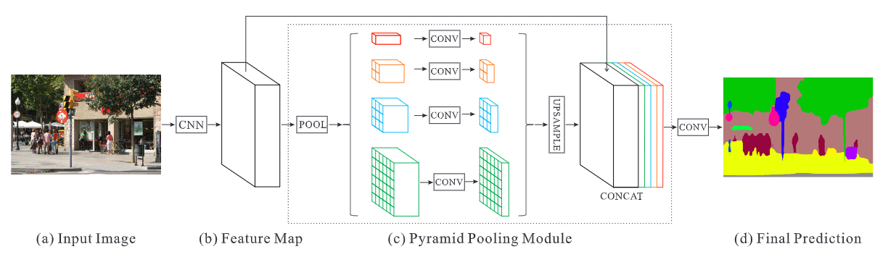

# NAIC2020_AI+Remote Sensing Image 

**Team**： 闲鱼（A Leaderboard 25th, B Leaderboard 19th）

## Environment Configuration

Our codes are mainly based on [mmsegmentation](https://github.com/open-mmlab/mmsegmentation), so the relevant environment configuration can refer to the official [installation document](docs/install.md)

Create `data` folder in the project root directory to store subsequent model files and other data.

## Data Preparation

In order to adapt to the data set API of mmsegmentation, we will generate a json file for each data subset, describing the picture and the position of the mask. Taking test_B as an example, it can be generated by the following command:

```bash
python pys/generate_ann_file.py \
    [path-to-test_B-images] \
    --save_path data/test_B.json
```

> If it is to generate the json file of the training set, also pass in `--mask_dir` to indicate the label folder path

## Model

In terms of models, we mainly focused on the DeepLabV3+ and PSPNet segmentation models during the contest.



<center><p>PSPNet</p></center>

From our experimental results, PSPNet is superior to DeepLabV3+ in the following aspects:

- Segmentation Performance: PSPNet is 1.5% higher than DeepLabV3+
- Video Memory: PSPNet uses pooling operations of different scales (1,2,3,6) and doesn't use a convolutional layer with a large expansion rate. The video memory is 1~2G less than DeepLabV3+, which is convenient for us to use larger batch size

## Innovation

### Data Preprocessing Process

The image input is uniformly resized to 512 x 512 size. We found that all enhancement techniques that affect ordinary natural images (including random cropping, multi-scale training, random exchange of RGB channels, random noise, etc.) do not work in the field of remote sensing, but have a great weakening effect on the performance of the final model . So in the preprocessing stage, we only performed the image resize operation, and discarded any enhancement operations, including left and right flips.

```python
train_pipeline = [
    dict(type='LoadImageFromFile'),      
    dict(type='LoadAnnotationsOne'),     
    dict(type='Resize', img_scale=(512, 512), ratio_range=None),  # resize
    dict(type='Normalize', **img_norm_cfg),
    dict(type='Pad', size=crop_size, pad_val=0, seg_pad_val=255),
    dict(type='DefaultFormatBundle'),
    dict(type='Collect', keys=['img', 'gt_semantic_seg']),
]
```

### Two-stage training

Because the segmentation network requires a larger output map, the training cost of the model is much greater than that of the ordinary classification network. Here we use d8 to represent the output stride of the output map as 8 (similarly, d16 refers to the output stride as 16). The optimizer uses the momentum version of SGD, and the lr drop strategy uses poly. Here we use a two-stage training method:

1. In the first stage, the backbone network parameters are loaded from the ImageNet pre-trained model, d16 training is 320K, the learning rate is reduced from 1e-2 to 1e-4, and the offline mIoU is preferably 80.84%;
2. In the second stage, the model loads the last ckpt of the first stage, and d8 is trained at 320K. The learning rate is reduced from 1e-3 to 1e-4, and the offline mIoU is preferably 82.38%

### Training Iterations

Our experiment found that the training of the remote sensing data set is difficult to converge to the optimal result, so the performance is close to convergence from the original 20K training iteration step up to 320K.


## Test

We provide the test script `run.sh`, download the optimal [model file]() from the release page of github and place it in the `data` directory, and then execute the following command

```bash
./run.sh test data/iter_304000.pth out_1018.pkl 
```

There are related parameters in the `run.sh` file for modification, such as the number of GPUs used and the configuration file path (the current optimal model configuration file is used by default). After execution, the model's forwarding operation will be executed first, and the result will be output to an intermediate file `out_1018.pkl`, and then the script will read the file and write it into a zip file in the officially specified format, the path is `data/res.zip`